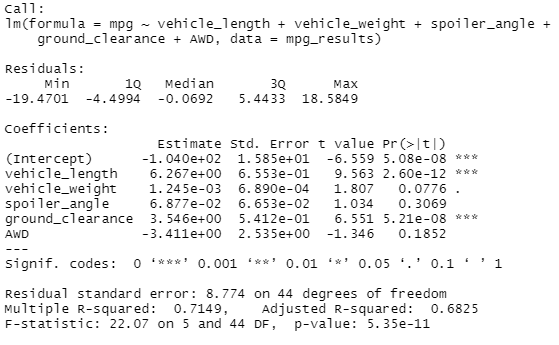
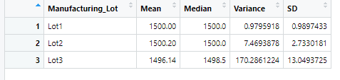
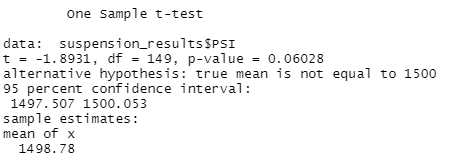
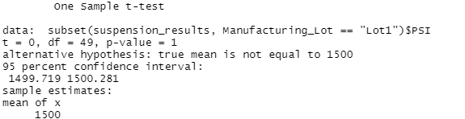
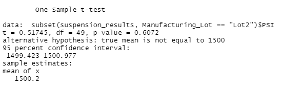
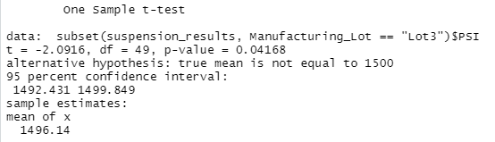

# MechaCar_Statistical_Analysis

## Overview
The purpose of this analysis is to review the production data for insights that may help the manufacturing team. Currently, AutosRUs' newest protoypte, the MechaCar, is suffering from production troubles that are blocking the manufacturing team's progress. In this challenge, the following taks are performed:

- Perform multiple linear regression analysis to identify which variables in the dataset predict the mpg of MechaCar prototypes
- Collect summary statistics on the pounds per square inch (PSI) of the suspension coils from the manufacturing lots
- Run t-tests to determine if the manufacturing lots are statistically different from the mean population
- Design a statistical study to compare vehicle performance of the MechaCar vehicles against vehicles from other manufacturers. For each statistical analysis, an interpretation of the findings will be summarized.

## Linear Regression to Predict MPG
- Screenshot of the output from linear regression:

### Summary

- Which variables/coefficients provided a non-random amount of variance to the mpg values in the dataset?

Vehicle length and ground clearance provided a non-random amount of variance to the mpg values in the dataset.

- Is the slope of the linear model considered to be zero? Why or why not?

The slope of the linear model is not considered to be zero. This is because there are at least two independent variables (vehicle length and ground clearance) that impact MPG.

- Does this linear model predict mpg of MechaCar prototypes effectively? Why or why not?

Yes, this linear model does predict mpg of MechaCar prototypes effectively. This is because the adjusted r-square value is 0.6825, which is considered as moderate correlation on the Pearson's Correlation table.

## Summary Statistics on Suspension Coils
- Screenshot of the total summary dataframe:

- Screenshot of the lot summary dataframe:

### Summary

- The design specifications for the MechaCar suspension coils dictate that the variance of the suspension coils must not exceed 100 pounds per square inch. Does the current manufacturing data meet this design specification for all manufacturing lots in total and each lot individually? Why or why not?

When reviewing the total summary dataframe, all three manufacturing lots have a variance of 62.29356 PSI, which is less than 100 PSI design specifications. However, at an individual lot level, only Lot 1 and Lot 2 met the design specification for suspension coils variance. Lot 3 didn't meet the design specification as 170.2861224 PSI exceed the 100 PSI requirement for suspension coils variance.

## T-Tests on Suspension Coils

-Screenshot of the T Test on all lots:

-Screenshot of the T Test on Lot 1:

-Screenshot of the T Test on Lot 2:

-Screenshot of the T Test on Lot 3:

### Summary of T-test results across all manufacturing and for each lot

- The p-value of all manufacturing lots was 0.06028. This p-value is greater than the significance level of 0.05, which means all manufacturing lots are statistically similar.
- For Lot 1, the p-value is 1, which is greater than the significance level of 0.05. As a result, the two means are statistically similar.
- For Lot 2, the p-value is 0.6072, which is greater than the significance level of 0.05. As a result, the two means are statistically similar.
- For Lot 3, the p-value is 0.04168, which is lower than the significance level of 0.05. As a result, the two means are not statistically similar.

## Study Design: MechaCar vs Competition

